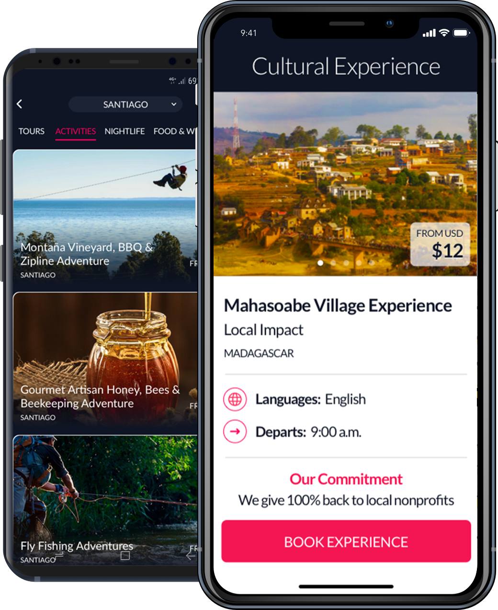

[Home](index.md)

## Experience

### Velco

I led the iOS team working on the main features, as Bluetooth communication and Over the air updates, track & trace, navigation and mobile subscriptions for both Wink Bar and Velco Tour iOS apps.

#### Wink Bar

* [AppStore link](https://apps.apple.com/fr/app/wink-bar-bike-gps-tracking/id1386766589)

#### Velco Tour

* [AppStore link](https://apps.apple.com/fr/app/velco-tour-tourism-guide/id1447098734)

### KeyoCoin (formerly TheBesty)

#### KeyoPass

Built their main iOS app, written in Objective-C and Swift, with features as a Real-time Chat with a Hotel concierge, Tour bookings using Stripe payments and downloading content for offline use. I was part of a multicultural team working on an English speaking environment.

* [AppStore link](https://itunes.apple.com/us/app/keyopass-your-crypto-concierge/id1020945768)
* [Source](https://keyopass.com)
