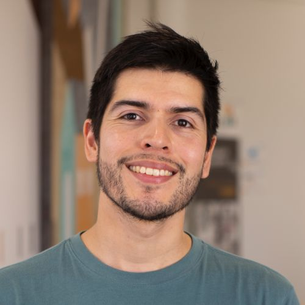
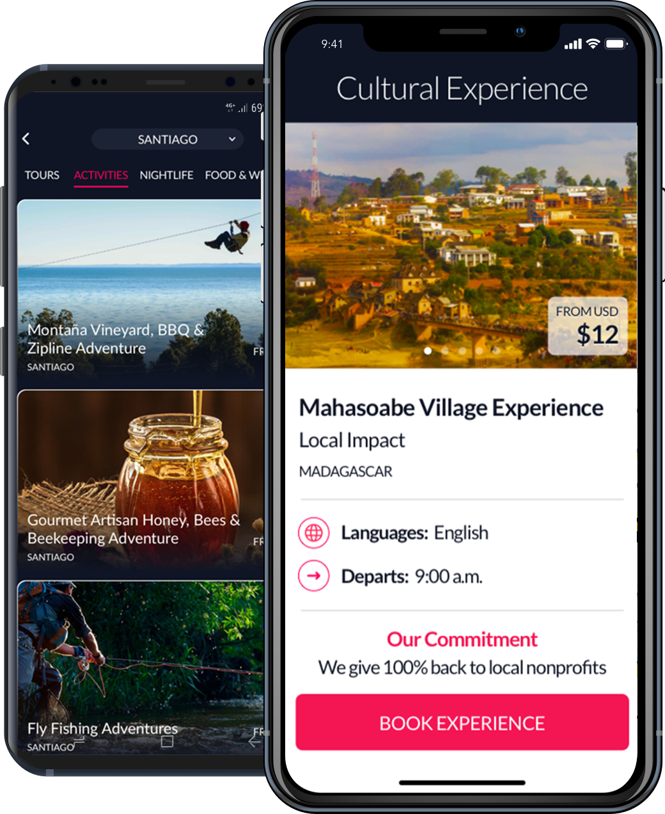

# Nicolás García

I'm Nicolás García, a software engineer from Chile currently living in Paris area, France.

I'm currently part of the Security products iOS team at [Netatmo](https://www.netatmo.com). In the past, I led the iOS teams at [Velco](https://velco.bike), building IoT products for Smart mobility and bike tracking, and [KeyoCoin](https://keyopass.com) - formerly _TheBesty_ -,  real time chat hotel concierge and tour booking for travelers.

* [GitHub](https://github.com/nicoonguitar)
* [Twitter](https://twitter.com/nicoonguitar)

## Public speaking

I recently got into public speaking, [here](https://github.com/nicoonguitar/talks) are my talks so far.

## Portfolio

### Wink Bar

* [AppStore link](https://apps.apple.com/fr/app/wink-bar-bike-gps-tracking/id1386766589)

### Velco Tour

* [AppStore link](https://apps.apple.com/fr/app/velco-tour-tourism-guide/id1447098734)

### KeyoPass

#### The Social Impact Travel App

Discover and book unique local experiences, tours, activities, and hotels, while helping the communities where you travel. You book, and we donate to a local nonprofit at your destination.

* [AppStore link](https://itunes.apple.com/us/app/keyopass-your-crypto-concierge/id1020945768)
* [Source](https://keyopass.com)

### AptoVegan

Whether you’re an expert vegan or you have just begun, finding products that are suitable for you at the supermarket will be much easier by using AptoVegan.

* [AppStore link](https://apps.apple.com/ar/app/aptovegan/id1281331534)
* [Source](https://aptovegan.com/en/)